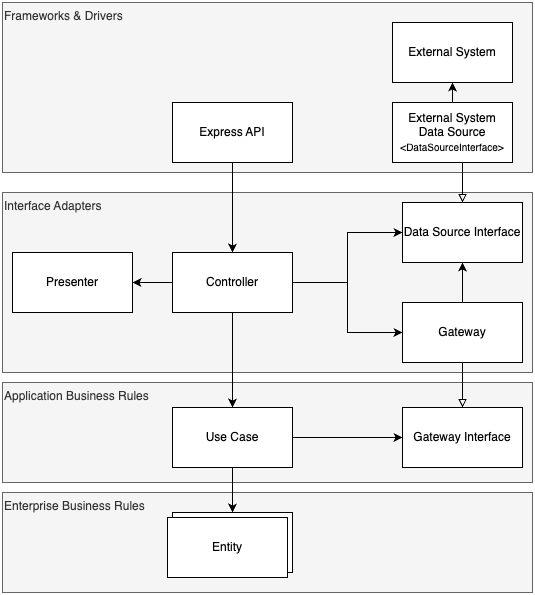
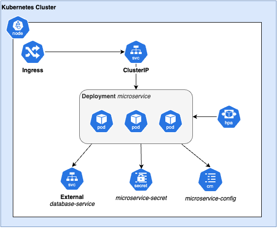
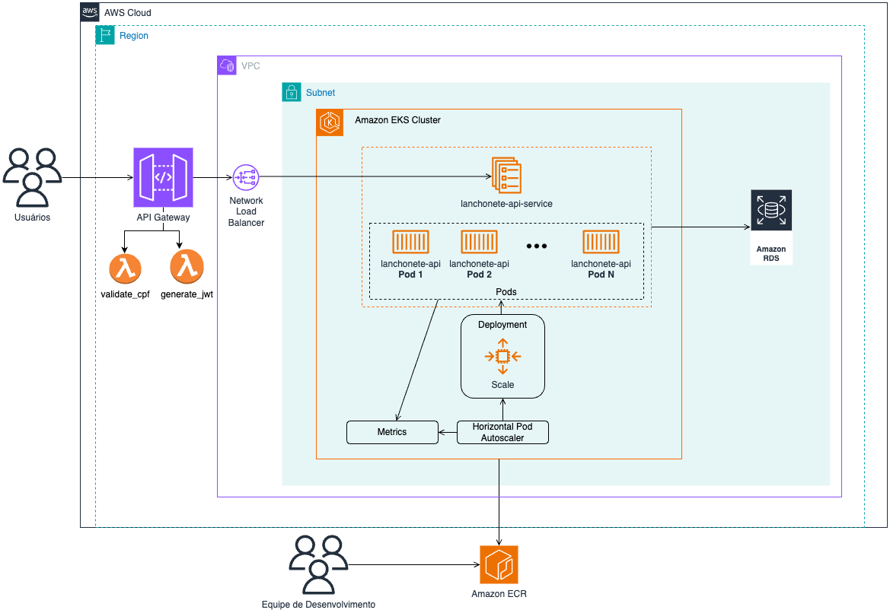

# Software Architecture Tech Challenge - Lanchonete

Projeto desenvolvido para a pós-graduação em Software Architecture da FIAP utilizando princípios de Arquitetura Limpa.

Desenvolvido por @ThawanFidelis, @gabrielescodino, @vitorrafael e @anadezuo.

#### Tabela de Conteúdos

1. [Requisitos](#requisitos)
2. [Microsserviços](#microsserviços)
3. [Arquitetura](#arquitetura)
    - [Arquitetura do Sistema](#arquitetura-do-sistema)
    - [Arquitetura do Kubernetes](#arquitetura-do-kubernetes)
    - [Arquitetura AWS](#arquitetura-aws)
7. [Tarefas](#tarefas)

## Requisitos

### Requisitos Funcionais

| Identificador | Descrição                                                                                                                                               |
| ------------- | ------------------------------------------------------------------------------------------------------------------------------------------------------- |
| RF-1          | Sistema deve fornecer API para cadastrar o cliente.                                                                                                     |
| RF-2          | Sistema deve fornecer API para identificar o cliente por CPF.                                                                                           |
| RF-3          | Sistema deve fornecer API para criar, editar e remover produtos.                                                                                        |
| RF-4          | Sistema deve fornecer API para buscar produtos por categoria.                                                                                           |
| RF-5          | Sistema deve fornecer API para realizar o checkout do pedido; durante a Fase 1, deverá ser implementado um _fake checkout_.                             |
| RF-6          | Sistema deve fornecer API para listar os pedidos.                                                                                                       |
| RF-7          | Sistema deve fornecer API para consultar o status de pagamento do pedido, se foi aprovado ou recusado.                                                  |
| RF-8          | Sistema deve fornecer um _webhook_ para receber confirmação do pagamento aprovado ou recusado.                                                          |
| RF-9          | Sistema deverá ordenar os pedidos pelo status 'Pronto' > 'Em Preparação' > 'Recebido' e data de criação. Pedidos 'Finalizado' não devem ser retornados. |
| RF-10         | Sistema deverá fornecer API para atualizar o status do pedido.                                                                                          |
| RF-11         | Sistema deverá integrar com Mercado Pago.                                                                                                               |

### Requisitos Não-Funcionais

| Identificador | Descrição                                                                                                                         |
| ------------- | --------------------------------------------------------------------------------------------------------------------------------- |
| RNF-1         | Sistema deverá ser desenvolvido seguindo os princípios de Arquitetura Limpa.                                                      |
| RNF-2         | Sistema deverá fornecer a documentação das APIs por Swagger ou Postman Collection.                                                |
| RNF-3         | Infraestrutura - Sistema deverá ser desenvolvido utilizando Kubernetes para aumentar a sua resiliência.                           |
| RNF-4         | Infraestrutura - Sistema deverá suportar o aumento de demanda, subindo novas instâncias conforme o número de requisições aumenta. |
| RNF-5         | Infraestrutura - Sistema deverá seguir arquitetura de microsserviços.                                                             |

## Microsserviços

O sistema foi desenvolvido em uma arquitetura de microsserviços com os seguintes serviços implementados em Kubernetes:
| Nome | Descrição | Repositório
|------|-----------|-------------
| `customer` | Responsável pelo gerenciamento dos clientes cadastrados. | [tech-challenge-customer](https://github.com/FIAP-8SOAT-G6/tech-challenge-customer)
| `products` | Responsável pelo gerenciamento dos produtos. | [tech-challenge-products](https://github.com/FIAP-8SOAT-G6/tech-challenge-products)
| `orders` | Responsável pelo gerenciamento dos pedidos, interagindo com os outros microsserviços através de chamadas síncronas HTTP. | [tech-challenge-orders](https://github.com/FIAP-8SOAT-G6/tech-challenge-orders)

Adicionalmente, os seguintes repositórios são utilizados para suportar a API e infraestrutura:
| Repositório | Descrição
|------|-----------
| [tech-challenge-swagger-ui](https://github.com/FIAP-8SOAT-G6/tech-challenge-swagger-ui) | Consolidação da documentação de Swagger.
| [k8s-infrastructure](https://github.com/FIAP-8SOAT-G6/k8s-infrastructure) | Responsável pela criação da infraestrutura Kubernetes.
| [db-infrastructure](https://github.com/FIAP-8SOAT-G6/db-infrastructure) | Responsável pela criação dos bancos de dados Postgres (SQL) e Elasticache (NoSQL).

## Arquitetura

### Arquitetura do Sistema

A aplicação foi desenvolvida seguindo os princípios da Arquitetura Limpa (Clean Architecture) proposta por Robert C. Martin. O objetivo é garantir que as regras de negócio fiquem isoladas e independentes de detalhes externos, como frameworks ou banco de dados, facilitando a manutenção, escalabilidade e testabilidade da aplicação.

- **Enterprise Business Rules**: Camada que contém as entidades (_Entities_) do domínio, que representam os conceitos centrais e regras mais importantes da aplicação que garantem a consistência das regras de negócio. São independentes de infraestrutura ou do caso de uso em que são utilizadas.
- **Application Business Rules**: Camada que contém os casos de uso (_Use Case_) que definem como as entidades interagem entre si para cumprir os requisitos funcionais da aplicação. São independentes dos detalhes de infraestrutura e dependem apenas de interfaces para interagir com objetos externos.
- **Interface Adapters**: Camada que adapta a entrada e saída de dados entre o sistema e os consumidores externos, responsável pela lógica que conecta os casos de uso ao mundo exterior. Seus principais componentes são:
  - **Gateways:** Implementações das interfaces dos casos de uso para acessar sistemas externos (exemplo: banco de dados, sistemas de pagamento);
  - **Presenters:** Adaptam o resultado dos casos de uso para as camadas externas conforme o formato esperado;
  - **Controllers:** Recebem as requisições externas e executam os casos de uso com suas respectivas dependências.
- **Frameworks & Drivers**: Camada com _frameworks_ e serviços externos usados pela aplicação como bibliotecas de _Web API_, objetos que encapsulam comunicação com banco de dados, sistemas externos, etc. Serve apenas para viabilizar a interação com o mundo exterior, sem lógica de negócios.

No diagrama a seguir, é possível identificar que cada camada se comunica de forma unidirecional, com as camadas externas dependendo das internas. Isso garante que as regras de negócio permaneçam independentes de detalhes técnicos. Para tanto, é necessário seguir os princípios SOLID como o _Single Responsibility Principle_, uma vez que cada objeto e camada tem uma única responsabilidade, e o _Dependency Inversion Principle_, visto que as camadas internas dependem de abstrações e as implementações são fornecidas pelas camadas externas.



### Arquitetura do Kubernetes

A arquitetura K8s foi desenvolvida para permitir a escalabilidade do sistema conforme a demanda. O diagrama a seguir representa essa estrutura:



A aplicação opera dentro de um cluster Kubernetes, onde os _nodes_ seguem a seguinte estrutura:

- **Ingress:** Responsável por encaminhar as requisições para o serviço correspondente ao recurso solicitado.
- **Deployment:** Responsável por gerenciar os pods que executam o microserviço desenvolvido. Possui um **Horizontal Pod Autoscaler (HPA)** associado para monitorar a utilização de CPU e escalar horizontalmente os pods, a fim de suportar a demanda por recursos. É exposto ao exterior através de um **Service ClusterIP** para que clientes consigam consumir as APIs desenvolvidas por meio de um **Ingress**.
- **ConfigMap:** Utilizados para armazenar os valores de configuração da API e do banco de dados, como parâmetros não sensíveis e informações de ambiente.
- **Secret:** Utilizado para armazenar valores sensíveis, como a senha de acesso ao banco de dados.

#### Fluxo de Comunicação

1. O Ingress faz o mapeamento dos recursos para os Services ClusterIP que expõem as APIs externamente, encaminhando as requisições para os diferentes pods gerenciados pelos Deployments.
2. Os pods se comunicam com o banco de dados por meio de um ExternalName Service, que encaminha as requisições para serviços de bancos de dados.
   > Os ConfigMaps e o Secret são utilizados durante a inicialização dos pods para configurar a conexão com o banco de dados e outros serviços externos

### Arquitetura AWS



A arquitetura proposta utiliza serviços gerenciados da AWS para oferecer uma solução escalável e resiliente. Seguem os principais componentes:

- **Network Load Balancer (NLB)**: Encaminha as requisições dentro da **Virtual Private Cloud (VPC)** para o **Amazon Elastic Kubernetes Service (EKS)**.

- **Amazon EKS (Elastic Kubernetes Service)**: O sistema é implantado em um **Amazon EKS Cluster** dentro de uma **sub-rede privada**. Os detalhes sobre o Cluster K8S podem ser encontrados em [Arquitetura do Kubernetes](#arquitetura-do-kubernetes)

- **Amazon RDS (Relational Database Service)**: Serviço para provisionamento do banco de dados Postgres.

- **Amazon Elasticache (Cache Database Service)**: Serviço para provisionamento do banco de dados Elasticache.

- **Amazon ECR (Elastic Container Registry)**: Armazenamento das imagens dos containers do sistema, facilitando a atualização dos pods dentro do cluster EKS que utilizam tags versionadas.

## Ordem de execução das APIs

Para realizar a emissão de um pedido até sua finalização, as APIs precisam ser chamadas na seguinte sequência:

#### 1. Adicionar produtos

Os produtos precisam ser adicionados a um catálogo para que posteriormente possam ser adicionados no pedido de venda.

Endpoint: `POST /products`

Exemplo:

```JSON
{
  "name": "Hamburguer",
  "category": "Lanche",
  "price": 12.99,
  "description": "Hamburguer Clássico",
  "images": [
    {
      "url": "https://upload.wikimedia.org/wikipedia/commons/6/6a/JavaScript-logo.png"
    },
    {
      "url": "https://upload.wikimedia.org/wikipedia/commons/6/6a/novo-logo.png"
    },

  ]
}
```

#### 1.1 [Opcional] Listar todos os produtos

Endpoint: `GET /products`

#### 1.2 [Opcional] Listar produto pelo ID

Necessário informar o ID do produto a ser procurado.

Endpoint: `GET /products/{id}`

#### 1.3 [Opcional] Listar produtos pela categoria

É possível buscar os produtos com base em sua categoria.

Endpoint: `GET /category/{category}/products`

#### 1.4 [Opcional] Editar produto

Todos os campos que compõem um produto poderão ser alterados, com exceção do ID.

Endpoint: `PUT /products/{id}`

#### 1.5 [Opcional] Excluir um produto

Necessário informar o ID do produto a ser excluído.

Endpoint: `DELETE /products/{id}`

<hr>

#### 2. [Opcional] Cadastrar Cliente

Cadastra o cliente, permitindo seu vínculo com o pedido realizado.

Endpoint: `POST /customers`

Exemplo de Requisição:

```JSON
{
  "name": "John Doe",
  "cpf": "12345678909",
  "email": "john.doe@gmail.com"
}
```

#### 2.1 [Opcional] Buscar pelo Cliente

A busca do cliente pode ser realizada com base no CPF cadastrado.

Endpoint: `GET /customers/{cpf}`

<hr>

#### 3. Criar Pedido

Ao criar um pedido, o cliente poderá ser vinculado com o cliente previamente cadastrado, ou anonimamente inserindo o valor **null**.

Endpoint: `POST /orders`

Exemplo de Requisição:

```JSON
{
  "customerId": 1
}
```

<hr>

#### 4. Adicionar item ao pedido

Adiciona um item ao pedido, para isso é necessário informar o código do produto do catálogo e a quantidade do item.
Para essa ação o pedido precisará estar com o status em aberto, ou seja, antes da realização do pagamento.

Endpoint: `POST /orders/{orderId}/items`

```JSON
{
  "productId": 1,
  "quantity": 2
}

```

#### 4.1 [Opcional] Editar um item do pedido

É possível alterar a quantidade do item adicionado ao pedido.
Para essa ação o pedido precisará estar com o status em aberto, ou seja, antes da realização do pagamento.

Endpoint: `PUT /orders/{orderId}/items/{itemId}`

#### 4.2 [Opcional] Excluir um item do pedido

Exclui um item que foi adicionado ao pedido.
Para essa ação o pedido precisará estar com o status em aberto, ou seja, antes da realização do pagamento.
Endpoint: `DELETE /orders/{orderId}/items/{itemId}`

<hr>

#### 5. Realizar Checkout do pedido

Para o fechamento do pedido, é necessário que seja inserido pelo menos um item ao pedido.

Endpoint: `POST /orders/{orderId}/checkout`

<hr>

#### 6. Webhook

Recebe a confirmação sobre o pagamento estar aprovado ou recusado.

Enpoint: `POST /webhooks/payments`

```JSON
{
  "orderId": 1,
  "paymentStatus": "PENDING",
  "timestamp": "2024-01-01T12:00:00Z"
}
```

#### 6.1 [Opcional] Consulta do status de pagamento do pedido

Enpoint: `GET /orders/{orderId}/payment_status`

<hr>

#### 7. Listar o pedido em linha de produção

Após o pagamento do pedido, o mesmo passa pelas etapas de Recebido pela cozinha, Em preparação e Pronto.

Endpoint: `GET /orders`

<hr>

#### 8. Concluir pedido

Conforme o pedido avança em suas etapas de preparo, é realizada a atualização do status. A Atualização poderá ser feita com base na regra de atualização de status.

Ordem para atualização:

```JAVASCRIPT
'Criado' (CREATED)->
'Pagamento pendente' (PENDING_PAYMENT) ->
'Pago' (PAYED) ->
'Recebido' (RECEIVED) ->
'Em preparação' (PREPARING) ->
'Pronto' (DONE) ->
'Finalizado' (FINISHED)
```

Endpoint: `PUT /orders/{orderId}/status`

<hr>

#### 9. Listar os pedidos

Busca por todos os pedidos já cadastrados.

Endpoint: `GET /orders/all`

#### 9.1 [Opcional] Listar um pedido pelo ID

Realiza a busca de um pedido com base em seu id de cadastrado.

Endpoint: `GET /orders/{orderId}`

## Tarefas

As tarefas estão descritas em projetos da organização do GitHub.

- [Fase 1](https://github.com/orgs/FIAP-8SOAT-G6/projects/1)
- [Fase 2](https://github.com/orgs/FIAP-8SOAT-G6/projects/2)
  - [Apresentação do Projeto](https://youtu.be/1UloxK_VfNE)
- [Fase 3](https://github.com/orgs/FIAP-8SOAT-G6/projects/4)
