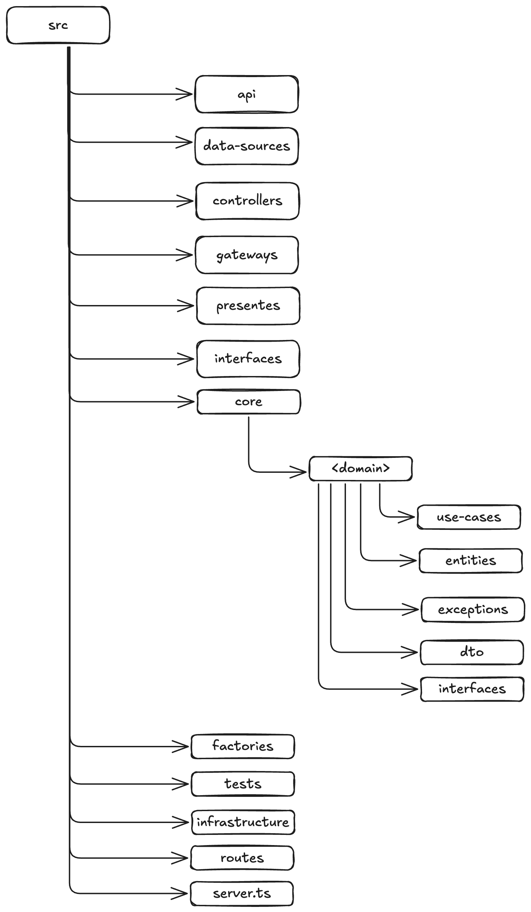

# Software Architecture Tech Challenge - Lanchonete

Projeto desenvolvido para a pós-graduação em Software Architecture da FIAP utilizando princípios de Arquitetura Limpa.

Desenvolvido por @ThawanFidelis, @gabrielescodino, @vitorrafael e @anadezuo.

#### Tabela de Conteúdos

1. [Rodando o Projeto](#rodando-o-projeto)
   1. [Pré-Requsiitos](#pré-requisitos)
   2. [Executando o Docker](#executando-o-docker)
   3. [Executando o Kubernetes](#executando-o-kubernetes)
   4. [Acessando as APIs](#acessando-as-apis)
   5. [Executando os Testes](#executando-os-testes)
2. [Tarefas](#tarefas)
3. [Tecnologias & Bibliotecas](#tecnologias--bibliotecas)
4. [Estrutura do Projeto](#estrutura-do-projeto)

## Rodando o Projeto

#### Pré-requisitos

- Ter a instalação do `docker` localmente.
- Ter alguma ferramenta para executar `kubernetes` localmente.

#### Executando o Docker

Para executar o projeto, deve ser realizado um dos seguintes comandos:

- `docker-compose up --build`
- `docker compose up --build`

\*_A flag `--build` é adicionada para garantir que a imagem esteja atualizada com as últimas modificações locais._

Para parar a execução do projeto, pode ser executado Ctrl+C e em seguida o comando

- `docker-compose down`

#### Executando o Kubernetes

Para executar o projeto utilizando Kubernetes, execute o seguinte comando:

- `kubectl apply -f k8s/ -R`
  > Pode ser necessário utilizar outro comando dependendo da ferramente de Kubernetes que estiveres utilizando.

Isso criará os artefatos necessários accessar o projeto de um Cluster K8s.

#### Acessando as APIs

Ao acessar a URL `http://localhost:8080/` (`docker compose`) ou `http://localhost:31200` (`kubernetes`), você será redirecionado a documentação Swagger das APIs e poderá executar as requisições conforme documentado.

> Caso você esteja executando em Cluster Kubernetes, pode ser necessário habilitar criar um _tunnel_ entre a sua máquina e o Cluster Kubernetes. Por exemplo:  
> Minikube - `minikube service lanchonete-api-servce --url`  
> Docker Desktop - `kubectl port-forward services/lanchonete-api-service 8080:80`  
> Isso é necessário apenas se não conseguir acessar o Cluster de seu `localhost`.

#### Executando os testes

Execute `npm run test` para rodar os testes unitários da aplicação

## Tarefas

As tarefas estão descritas em projetos da organização do GitHub.

- [Fase 1](https://github.com/orgs/FIAP-8SOAT-G6/projects/1)
- [Fase 2](https://github.com/orgs/FIAP-8SOAT-G6/projects/2)

## Tecnologias & Bibliotecas

- NodeJS (^v22) & TypeScript
  - `express` - https://www.npmjs.com/package/express
  - `sequelize` - https://www.npmjs.com/package/sequelize
- Postgres
- Docker
- Swagger
  - `swagger-jsdoc` - https://www.npmjs.com/package/swagger-jsdoc
  - `swagger-ui-express` - https://www.npmjs.com/package/swagger-ui-express

## Estrutura do Projeto

- `src` - Código fonte do projeto.
- `src/api` - **Framework & Drivers** - Objetos que fazem a comunicação com o `express` para criar a API.
- `src/api` - **Frameworks & Drivers** - Objetos que fazem a comunicação com o `sequelize` para accessar o banco de dados.
- `src/controllers` - **Interface Adapters** - Objetos que fazem a orquestração dos casos de uso para executar as regras de negócio.
- `src/gateways`- **Interface Adapters** - Objetos que intermediam a comunicação entre os casos de uso e os dados externos da aplicação, implementando as interfaces definidas pelos `use-cases`.
- `src/presenters` - **Interface Adapters** - Objetos que formatam os dados retornados pelos `use-cases` para serem retornados ao cliente.
- `src/interfaces` - **Interface Adapters** - Interfaces definidas pelos objetos pertencentes a esta camada para comunicação com objetos da camada **Framework & Drivers**
- `src/core` - Objetos do domínio da solução. Não devem depender de objetos que são criados fora dessa camada, devendo utilizar interfaces e injeção de dependência para execução da aplicação.
- `src/core/interfaces` - Interfaces definidas pelos objetos pertencentes a esta camada para comunicação com objetos externos (**Interface Adapters**);
- `src/core/<domain>/entities` - **Enteprise Business Rules** Entidades do domínio conforme identificado através dos exercícios de Domain-Driven Design.
- `src/core/<domain>/use-cases` - **Application Business Rules** Processos de negócio que foram identificados dentro do domínio; executados através da orquestração das entidades e das interfaces.
- `src/core/<domain>/exceptions` - Exceções lançadas pelos processos de negócio e entidades;
- `src/core/<domain>/dto` - Objetos para transferência de dados entre as camadas da aplicação;
- `src/factories` - Classes que auxiliam a instânciar os objetos das demais camadas.
- `src/tests` - Testes do projeto.
- `src/infrastructure` - Configurações de infraestrutura como banco de dados e documentação
- `src/routes` - Descrição das rotas do projeto para o Swagger.
- `app.js` - Ponto de entrada da aplicação, onde os objetos são instanciados com suas respectivas dependências e a aplicação começa a ser executada.

**OBS:** O arquivo `.env` foi compartilhado neste repositório para fins didáticos e facilidade nos testes, sendo esta uma má prática em ambientes de desenvolvimento real.

