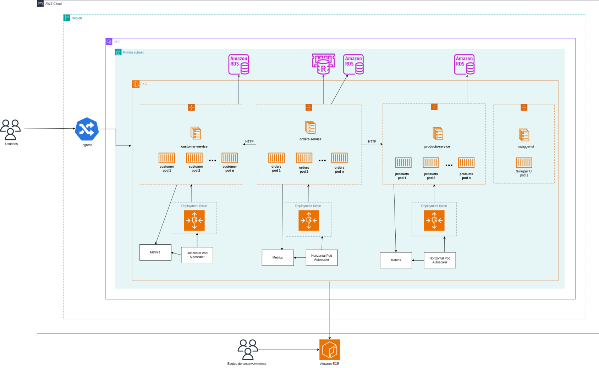

# Software Architecture Tech Challenge - Lanchonete

Projeto desenvolvido para a pós-graduação em Software Architecture da FIAP utilizando princípios de Arquitetura Limpa.

Desenvolvido por @ThawanFidelis, @gabrielescodino, @vitorrafael e @anadezuo.

#### Tabela de Conteúdos

1. [Requisitos](#requisitos)
2. [Arquitetura](#arquitetura)
   1. [Arquitetura da Aplicação](#arquitetura-da-aplicação)
   2. [Arquitetura do Kubernetes](#arquitetura-do-kubernetes)
   3. [Arquitetura AWS - Concepção](#arquitetura-aws---concepção)
3. [Rodando o Projeto](#rodando-o-projeto)
   1. [Pré-Requsiitos](#pré-requisitos)
   2. [Executando o Docker](#executando-o-docker)
   3. [Executando o Kubernetes](#executando-o-kubernetes)
   4. [Acessando as APIs](#acessando-as-apis)
   5. [Executando os Testes](#executando-os-testes)
4. [Tarefas](#tarefas)
5. [Tecnologias & Bibliotecas](#tecnologias--bibliotecas)
6. [Estrutura do Projeto](#estrutura-do-projeto)

## Requisitos

### Requisitos Funcionais

| Identificador | Descrição                                                                                                                                                  |
| ------------- | ---------------------------------------------------------------------------------------------------------------------------------------------------------- |
| RF-1          | Aplicação deve fornecer API para cadastrar o cliente.                                                                                                      |
| RF-2          | Aplicação deve fornecer API para identificar o cliente por CPF.                                                                                            |
| RF-3          | Aplicação deve fornecer API para criar, editar e remover produtos.                                                                                         |
| RF-4          | Aplicação deve fornecer API para buscar produtos por categoria.                                                                                            |
| RF-5          | Aplicação deve fornecer API para realizar o checkout do pedido; durante a Fase 1, deverá ser implementado um _fake checkout_.                              |
| RF-6          | Aplicação deve fornecer API para listar os pedidos.                                                                                                        |
| RF-7          | Aplicação deve fornecer API para consultar o status de pagamento do pedido, se foi aprovado ou recusado.                                                   |
| RF-8          | Aplicação deve fornecer um _webhook_ para receber confirmação do pagamento aprovado ou recusado.                                                           |
| RF-9          | Aplicação deverá ordernar os pedidos pelo status 'Pronto' > 'Em Preparação' > 'Recebido' e data de criação. Pedidos 'Finalizado' não devem ser retornados. |
| RF-10         | Aplicação deverá fornecer API para atualizar o status do pedido.                                                                                           |
| RF-11         | \[**Opcional**\] Aplicação deverá integrar com Mercado Pago.                                                                                               |

### Requisitos Não-Funcionais

| Identificador | Descrição                                                                                                                           |
| ------------- | ----------------------------------------------------------------------------------------------------------------------------------- |
| RNF-1         | Aplicação deverá ser desenvolvida seguindo os princípios de Arquitetura Limpa                                                       |
| RNF-2         | Aplicação deverá fornecer a documentação das APIs por Swagger ou Postman Collection                                                 |
| RNF-3         | Infraestrutura - Aplicação deverá ser desenvolvida utilizando Kubernetes para aumentar a sua resiliência.                           |
| RNF-4         | Infraestrutura - Aplicação deverá suportar o aumento de demanda, subindo novas instâncias conforme o número de requisições aumenta. |

## Arquitetura

### Arquitetura da Aplicação

A aplicação foi desenvolvida seguindo os princípios da Arquitetura Limpa (Clean Architecture) proposta por Robert C. Martin. O objetivo é garantir que as regras de negócio fiquem isoladas e independentes de detalhes externos, como frameworks ou banco de dados, facilitando a manutenção, escalabilidade e testabilidade da aplicação.

- **Enterprise Business Rules**: Camada que contém as entidades (_Entities_) do domínio, que representam os conceitos centrais e regras mais importantes da aplicação que garantem a consistência das regras de negócio. São independentes de infraestrutura ou do caso de uso em que são utilizadas.
- **Aplication Business Rules**: Camada que contém os casos de uso (_Use Case_) que definem como as entidades interagem entre si para cumprir os requisitos funcionais da aplicação. São independentes dos detalhes de infraestrutura e dependem apenas de interfaces para interagir com objetos externos.
- **Interface Adapters**: Camada que adapta a entrada e saída de dados entre o sistema e os consumidores externos, responsável pela lógica que conecta os casos de uso ao mundo exterior. Seus principais componentes são:
  - **Gateways:** Implementações das interfaces dos casos de uso para acessar sistemas externos (exemplo: banco de dados, sistemas de pagamento);
  - **Presenters:** Adaptam o resultado dos casos de uso para as camadas externas conforme o formato esperado;
  - **Controllers:** Recebem as requisições externas e executam os casos de uso com suas respectivas dependências.
- **Frameworks & Drivers**: Camada com _frameworks_ e serviços externos usados pela aplicação como bibliotecas de _Web API_, objetos que encapsulam comunicação com banco de dados, sistemas externos, etc. Serve apenas para viabilizar a interação com o mundo exterior, sem lógica de negócios.

No diagrama a seguir, é possível identificar que cada camada se comunica de forma unidirecional, com as camadas externas dependendo das internas. Isso garante que as regras de negócio permaneçam independentes de detalhes técnicos. Para tanto, é necessário seguir os princípios SOLID como o _Single Responsibility Principle_, uma vez que cada objeto e camada tem uma única responsabilidade, e o _Dependency Inversion Principle_, visto que as camadas internas dependem de abstrações e as implementações são fornecidas pelas camadas externas.


### Arquitetura do Kubernetes

A arquitetura K8s foi desenvolvida para permitir a escalabilidade do sistema conforme a demanda. O diagrama a seguir representa essa estrutura:


A aplicação opera dentro de um cluster Kubernetes, onde os _nodes_ seguem a seguinte estrutura:

- **Deployment lanchonete-api:** Responsável por gerenciar os pods que executam a aplicação desenvolvida. Possui um **Horizontal Pod Autoscaler (HPA)** associado para monitorar a utilização de CPU e escalar horizontalmente os pods, a fim de suportar a demanda por recursos. É exposto ao exterior através de um **Service NodePort** para que clientes consigam consumir as APIs desenvolvidas.
- **StatefulSet lanchonete-db:** Responsável por gerenciar o banco de dados da aplicação. Está vinculado a um **Persistent Volume Claim (PVC)** para garantir o armazenamento persistente dos dados, utilizando um Persistent Volume. O banco de dados é acessível apenas dentro do cluster K8s por meio de um **ClusterIP Service**, de forma que os pods da aplicação possam se conectar ao banco de dados de maneira segura.
- **ConfigMaps lanchonete-api-config e lanchonete-db-config**: Utilizados para armazenar os valores de configuração da API e do banco de dados, como parâmetros não sensíveis e informações de ambiente.
- **Secret lanchonete-db-secret:** Utilizado para armazenar valores sensíveis, como a senha de acesso ao banco de dados.

> **TODO**: Atualizar documentação da Arquitetura do Kubernetes com as últimas alterações da Fase 3.

#### Fluxo de Comunicação

1. O NodePort Service expõe a API externamente, encaminhando as requisições para os diferentes pods gerenciados pelo Deployment `lanchonete-api`.
2. Os pods `lanchonete-api` se comunicam com o `lanchonete-db` por meio de um ClusterIP Service, que encaminha as requisições para os pods do banco de dados, gerenciados pelo StatefulSet. Assim, o `lanchonete-api` pode realizar as operações necessárias no banco de dados.
   > Os ConfigMaps e o Secret são utilizados durante a inicialização dos pods para configurar a conexão com o banco de dados e outros serviços externos

### Arquitetura AWS



A arquitetura proposta utiliza serviços gerenciados da AWS para oferecer uma solução escalável e resiliente. Seguem os principais componentes:

- **Amazon API Gateway**: Os usuários finais interagem com a API por meio do **API Gateway**, que atua como o serviço responsável por rotear o tráfego.

- **Network Load Balancer (NLB)**: Encaminha as requisições dentro da **Virtual Private Cloud (VPC)** para o **Amazon Elastic Kubernetes Service (EKS)**.

- **Amazon EKS (Elastic Kubernetes Service)**: A aplicação é implantada em um **Amazon EKS Cluster** dentro de uma **sub-rede privada**. Os detalhes sobre o Cluster K8S podem ser encontrados em [Arquitetura do Kubernetes](#arquitetura-do-kubernetes)

- **Amazon RDS (Relational Database Service)**: Serviço para provisionamento do banco de dados Postgres.

- **Amazon ECR (Elastic Container Registry)**: Armazenamento das imagens dos containers da aplicação, facilitando a atualização dos pods dentro do cluster EKS que utilizam a tag _latest_.

## Executando o Projeto

#### Pré-requisitos

- Ter a instalação do `docker` localmente.
- Ter alguma ferramenta para executar `kubernetes` localmente.

#### Executando o Docker

Para executar o projeto, deve ser realizado um dos seguintes comandos:

- `docker-compose up --build`
- `docker compose up --build`

\*_A flag `--build` é adicionada para garantir que a imagem esteja atualizada com as últimas modificações locais._

Para parar a execução do projeto, pode ser executado Ctrl+C e em seguida o comando

- `docker-compose down`

#### Executando o Kubernetes

Para executar o projeto utilizando Kubernetes, execute o seguinte comando:

- `kubectl apply -f k8s/ -R`
  > Pode ser necessário utilizar outro comando dependendo da ferramente de Kubernetes que estiveres utilizando.

Isso criará os artefatos necessários accessar o projeto de um Cluster K8s.

#### Acessando as APIs

Ao acessar a URL `http://localhost:8080/` (`docker compose`) ou `http://localhost:31200` (`kubernetes`), você será redirecionado a documentação Swagger das APIs e poderá executar as requisições conforme documentado.

> Caso você esteja executando em Cluster Kubernetes, pode ser necessário habilitar criar um _tunnel_ entre a sua máquina e o Cluster Kubernetes. Por exemplo:  
> Minikube - `minikube service lanchonete-api-servce --url`  
> Docker Desktop - `kubectl port-forward services/lanchonete-api-service 8080:80`  
> Isso é necessário apenas se não conseguir acessar o Cluster de seu `localhost`.

#### Executando os testes

Execute `npm run test` para rodar os testes unitários da aplicação

Execute teste de carga `k6` com `npm run test:k8s`

> Obs.: Instale o `k6` em sua máquina conforme: https://grafana.com/docs/k6/latest/set-up/install-k6/

## Orderm de execução das APIs

Para realiar a emissão de um pedido até sua finalização, as APIs precisam ser chamadas na seguinte sequência:

#### 1. Adicionar produtos

Os produtos precisaram ser adicionados a um catálogo para que posteriormente possam ser adicionados no pedido de venda.

Endpoint: `POST /products`

Exemplo:

```JSON
{
  "name": "Hamburguer",
  "category": "Lanche",
  "price": 12.99,
  "description": "Hamburguer Classico",
  "images": [
    "https://upload.wikimedia.org/wikipedia/commons/6/6a/JavaScript-logo.png"
  ]
}
```

#### 1.1 [Opcional] Listar todos os produtos

Endpoint: `GET /products`

#### 1.2 [Opcional] Listar produto pelo ID

Necessário informar o ID do produto a ser procurado.

Endpoint: `GET /products/{id}`

#### 1.3 [Opcional] Listar produtos pela categoria

É possível buscar os produtos com base em sua categoria.

Endpoint: `GET /category/{category}/products`

#### 1.4 [Opcional] Editar produto

Todos os campos que compõem um produto poderão ser alterados, com execessão do ID.

Endpoint: `PUT /products/{id}`

#### 1.5 [Opcional] Excluir um produto

Necessário informar o ID do produto a ser excluído.

Endpoint: `DELETE /products/{id}`

<hr>

#### 2. [Opcional] Cadastrar Cliente

Cadastra o cliente, permitindo seu vínculo com o pedido realizado.

Endpoint: `POST /customers`

Exemplo de Requisição:

```JSON
{
  "name": "John Doe",
  "cpf": "12345678909",
  "email": "john.doe@gmail.com"
}
```

#### 2.1 [Opcional] Buscar pelo Cliente

A busca do cliente pode ser realizada com base no CPF cadastrado.

Endpoint: `GET /customers/{cpf}`

<hr>

#### 3. Criar Pedido

Ao criar um pedido, o cliente poderá ser vinculado com o cliente previamente cadastrado, ou anonimamente inserindo o valor **null**.

Endpoint: `POST /orders`

Exemplo de Requisição:

```JSON
{
  "customerId": 1
}
```

<hr>

#### 4. Adicionar item ao pedido

Adiciona um item ao pedido, para isso é necessário informar o código do produto do catálogo e a quantidade do item.
Para essa ação o pedido precisará estar com o status em aberto, ou seja, antes da realização do pagamento.

Endpoint: `POST /orders/{orderId}/items`

```JSON
{
  "productId": 1,
  "quantity": 2
}

```

#### 4.1 [Opcional] Editar um item do pedido

É possível alterar a quantidade do item adicionado ao pedido.
Para essa ação o pedido precisará estar com o status em aberto, ou seja, antes da realização do pagamento.

Endpoint: `PUT /orders/{orderId}/items/{itemId}`

#### 4.2 [Opcional] Excluir um item do pedido

Exclui um item que foi adicionado ao pedido.
Para essa ação o pedido precisará estar com o status em aberto, ou seja, antes da realização do pagamento.
Endpoint: `DELETE /orders/{orderId}/items/{itemId}`

<hr>

#### 5. Realizar Checkout do pedido

Para o fechamento do pedido, é necessário que seja inserido pelo menos um item ao pedido.

Endpoint: `POST /orders/{orderId}/checkout`

<hr>

#### 6. Webhook

Recebe a confirmação sobre o pagamento estar aprovado ou recusado.

Enpoint: `POST /webhooks/payments`

```JSON
{
  "orderId": 1,
  "paymentStatus": "PENDING",
  "timestamp": "2024-01-01T12:00:00Z"
}
```

#### 6.1 [Opcional] Consulta do status de pagamento do pedido

Enpoint: `GET /orders/{orderId}/payment_status`

<hr>

#### 7. Listar o pedido em linha de produção

Após o pagamento do pedido, o mesmo passa pelas etapas de Recebido pela cozinha, Em preparação e Pronto.

Endpoint: `GET /orders`

<hr>

#### 8. Concluir pedido

Conforme o pedido avança em suas etapas de preparo, é realizada a atualização do status. A Atualização poderá ser feita com base na regra de atualização de status.

Ordem para atualização:

```JAVASCRIPT
'Criado' (CREATED)->
'Pagamento pendente' (PENDING_PAYMENT) ->
'Pago' (PAYED) ->
'Recebido' (RECEIVED) ->
'Em preparação' (PREPARING) ->
'Pronto' (DONE) ->
'Finalizado' (FINISHED)
```

Endpoint: `PUT /orders/{orderId}/status`

<hr>

#### 9. Listar os pedidos

Busca por todos os pedidos já cadastrados.

Endpoint: `GET /orders/all`

#### 9.1 [Opcional] Listar um pedido pelo ID

Realiza a busca de um pedido com base em seu id de cadastrado.

Endpoint: `GET /orders/{orderId}`

## Tarefas

As tarefas estão descritas em projetos da organização do GitHub.

- [Fase 1](https://github.com/orgs/FIAP-8SOAT-G6/projects/1)
- [Fase 2](https://github.com/orgs/FIAP-8SOAT-G6/projects/2)
  - [Apresentação do Projeto](https://youtu.be/1UloxK_VfNE)

## Tecnologias & Bibliotecas

- NodeJS (^v22) & TypeScript
  - `express` - https://www.npmjs.com/package/express
  - `sequelize` - https://www.npmjs.com/package/sequelize
- Postgres
- Docker
- Swagger
  - `swagger-jsdoc` - https://www.npmjs.com/package/swagger-jsdoc
  - `swagger-ui-express` - https://www.npmjs.com/package/swagger-ui-express

## Estrutura do Projeto

- `src` - Código fonte do projeto.
- `src/api` - **Framework & Drivers** - Objetos que fazem a comunicação com o `express` para criar a API.
- `src/external` - **Frameworks & Drivers** - Objetos que fazem a comunicação com o sistemas externos. Por exemplo, objetos `DataSource`que interagem com o `sequelize` para accessar o banco de dados.
- `src/controllers` - **Interface Adapters** - Objetos que fazem a orquestração dos casos de uso para executar as regras de negócio.
- `src/gateways`- **Interface Adapters** - Objetos que intermediam a comunicação entre os casos de uso e os dados externos da aplicação, implementando as interfaces definidas pelos `use-cases`.
- `src/presenters` - **Interface Adapters** - Objetos que formatam os dados retornados pelos `use-cases` para serem retornados ao cliente.
- `src/interfaces` - **Interface Adapters** - Interfaces definidas pelos objetos pertencentes a esta camada para comunicação com objetos da camada **Framework & Drivers**
- `src/core` - Objetos do domínio da solução. Não devem depender de objetos que são criados fora dessa camada, devendo utilizar interfaces e injeção de dependência para execução da aplicação.
- `src/core/interfaces` - Interfaces definidas pelos objetos pertencentes a esta camada para comunicação com objetos externos (**Interface Adapters**);
- `src/core/<domain>/entities` - **Enteprise Business Rules** Entidades do domínio conforme identificado através dos exercícios de Domain-Driven Design.
- `src/core/<domain>/use-cases` - **Application Business Rules** Processos de negócio que foram identificados dentro do domínio; executados através da orquestração das entidades e das interfaces.
- `src/core/<domain>/exceptions` - Exceções lançadas pelos processos de negócio e entidades;
- `src/core/<domain>/dto` - Objetos para transferência de dados entre as camadas da aplicação;
- `src/factories` - Classes que auxiliam a instanciar os objetos das demais camadas.
- `src/tests` - Testes do projeto.
- `src/infrastructure` - Configurações de infraestrutura como banco de dados e documentação
- `src/routes` - Descrição das rotas do projeto para o Swagger.
- `app.js` - Ponto de entrada da aplicação, onde os objetos são instanciados com suas respectivas dependências e a aplicação começa a ser executada.

**OBS:** O arquivo `.env` foi compartilhado neste repositório para fins didáticos e facilidade nos testes, sendo esta uma má prática em ambientes de desenvolvimento real.


