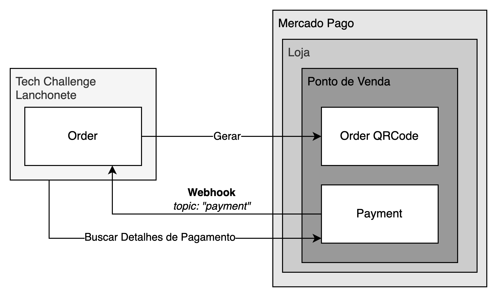

# Integração com Mercado Pago

A etapa de pagamento dos pedidos da solução é integrada com a API do Mercado Pago para geração dos QRCodes e processamento dos pagamentos.

[Documentação do Mercado Pago](https://www.mercadopago.com.br/developers)

## Fluxo da Integração

1. Criação do Pedido
2. Adição de Itens ao Pedido
3. **Checkout do Pedido**: Neste momento, a aplicação enviará uma requisição para o Mercado Pago com as informações do pedido. Nessa requisição, o Mercado Pago retornará uma `string` que pode ser utilizada para gerar QRCodes e realizar o pagamento.
4. **Pagamento do Pedido**: O usuário realiza o pagamento do pedido. Após o pagamento do pedido, o Mercado Pago enviará uma requisição para o `webhook` registrado no `notification_url` enviado durante o checkout do pedido.
5. **Webhook**: A requisição enviada pelo Mercado Pago possui duas informações: `topic: payment` e `id: <id do pagamento>`. O caso de uso responsável pela atualização do status do pedido então entra em contato com o Mercado Pago através de um `PaymentGateway` para buscar os detalhes de pagamento. Estes detalhes incluem o id do pedido e o status do pagamento.
6. **Atualização do Pedido**: O pedido é então atualizado com o status `PAYED`.

## Configurar Integração

Para estabelecer a integração entre a solução e o Mercado Pago, são necessárias quatro informações:

- `MERCADO_PAGO_USER_ID`: Identificador do Usuário Mercado Pago.
- `MERCADO_PAGO_ACCESS_TOKEN`: Token de Acesso do Usuário Mercado Pago.
- `MERCADO_PAGO_POINT_OF_SALE_ID`: Identificado do Ponto de Venda do Mercado Pago.
- `NOTIFICATION_URL_HOST`: URL na qual o serviço está exposto - deve estar visível para a web.

Para obter essas informações, siga os passos a seguir:

1. Crie uma conta no Mercado Pago.
2. Acesse o painel de desenvolvedores do Mercado Pago.
3. Crie uma aplicação dentro das integrações\*.
4. Gere dois usuários de teste: **Comprador** e **Vendedor**\*.
5. Acesse o Mercado Pago com a conta de **Vendedor**. A partir de agora, os passos serão realizados com essa conta.
6. Crie uma loja e um caixa\*\* através das APIs do Mercado Pago.
7. Teste a criação de um QR Code através da API do Mercado Pago\*\*\*.
   > Pode ser que você receba um erro 500 pois o Mercado Pago não terminou algum processamento relacionado ao usuário de vendedor

Com isso, as informações a seguir poderão ser passadas a aplicação:

- `MERCADO_PAGO_USER_ID`: ID do Usuário Vendedor.
- `MERCADO_PAGO_ACCESS_TOKEN`: Token de Acesso Produtivo do Usuário Vendedor.
- `MERCADO_PAGO_POINT_OF_SALE_ID`: `external_reference` utilizado ao criar o caixa.

A `NOTIFICATION_URL_HOST` pode ser fornecida ao utilizar o `ngrok` ([http](https://ngrok.com/docs/http/)) para expor o endpoint local na web.

> \* [Mercado Pago - QR Code - Pré-Requisitos](https://www.mercadopago.com.br/developers/pt/docs/qr-code/pre-requisites)  
> \*\* [Mercado Pago - QR Code - Loja e Caixa](https://www.mercadopago.com.br/developers/pt/docs/qr-code/stores-pos/stores-and-pos)  
> \*\*\* [Mercado Pago - QR Code Dinâmico API](https://www.mercadopago.com.br/developers/pt/reference/qr-dynamic/_instore_orders_qr_seller_collectors_user_id_pos_external_pos_id_qrs/post)

## Testando a Integração

Para testar a integração, bastar executa os passos descritos em [Fluxo da Integração](#fluxo-da-integração). Mais informações podem ser encontradas em [Documentação - Realizar compra teste](https://www.mercadopago.com.br/developers/pt/docs/qr-code/integration-test/dynamic-model/test-purchase).

> Para realizar o pagamento, utilize o usuário **Comprador** criado durante a configuração da integração.
