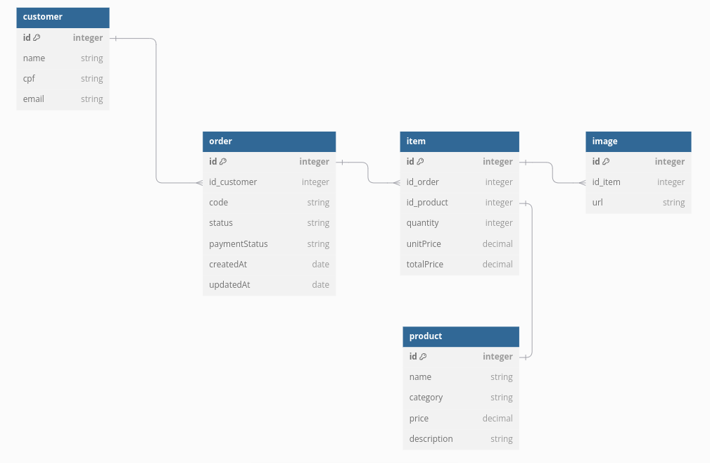

# Documentação do Banco de dados do Projeto da Lanchonete

Essa documentação tem com objetivo descrever a estrutura utilizada no projeto [Lanchonete](https://github.com/FIAP-8SOAT-G6/tech-challenge-lanchonete).
O projeto é uma solução para o modelo de negócio [B2C](https://www.totvs.com/blog/gestao-varejista/b2c/).

 

## Introdução: Modelo de negócio e tipo de banco de dados

O modelo de negócios da lanchonete é focado no armazenamento e gerenciamento dos pedidos de venda realizados pelos clientes.
Cada pedido inclui informações importantes e essenciais, como o cliente que está realizando o pedido (assim como o mesmo pode ser feito de forma anonima), os itens selecionados como sanduíches, bebidas, acompanhamentos, etc, juntamente com o valor total do pedido, a forma de pagamento e o status, que é atualizado conforme as etapas de pedido, pagamento e preparo.

O modelo de negócios da lanchonete é focado no armazenamento e gerenciamento dos pedidos de venda realizados pelos clientes.
Cada pedido contém informações importantes, indo desde o cadastro do cliente, passando pela seleção dos itens, pagamento, e atualização sobre o preprado até sua finalização.

A estrutura desses dados precisa ser organizada de maneira eficiente, garantindo confiabilidade e consistência. Por isso, optou-se pela utilização de um banco de dados relacional.

Os principais pontos levados em consideração foram:

- **Entidades**

  No modelo relacional, os dados são organizados em tabelas, que são separadas por entidade ou relacionamento entre as entidades.

  Como as entidades são ligadas umas as outras por meio de um identificador (chaves primárias), os dados não precisam ser replicados dentro da entidade que precisa dos dados.

  Caso uma entidade (como o cliente) sejam atualizada, todas as entidades que relacionam com ela (como o caso do pedido) também terão (caso na consulta realizada também retornar esses dados) as informações atualizadas.

- **Escalabilidade**

  A estrutura de tabela por entidade, permite que possa ser criado mais entidades, e relacionar essas com entidades existem sem grandes esforços.

  Como seria o caso da lanchonete expandir suas funcionlidades, e realizar por exemplos outras funções, como seria o caso de cadatrar tabelas promocionais, e vincular apenas os pedidos lançados a partir de uma data, sem precisar atualizar pedidos fechados, pois esses são apenas registros históricos.

- **Consulta dos dados**
  A linguagem SQL permite realizar consultas rápidas e complexas. E com base nos identificadores, é fácil manter um padrão de como os dados são buscados nas tabelas.

Os bancos relacionais permitem o armazenamento de dados como históricos, como pedidos antigos, sem risco de alterações indevidas, e dados mutavéis como o cadastro do cliente.
Por exemplo, um pedido concluído e entregue não pode ser alterado. Entretanto, mesmo que o pedido seja histórico, é essencial que as informações do cliente vinculado ao pedido, como o número de telefone, sejam sempre atualizadas. Em um banco de dados relacional, isso é possível graças à utilização de identificadores únicos para o cliente. Quando os dados do cliente são atualizados, o vínculo entre o pedido e o cliente permite que as informações do cliente sejam automaticamente refletidas em todos os pedidos associados a ele.

 

## Banco de dados: PostgresSQL

Com base nos bancos de dados disponíveis, o escolhido foi o PostgreSQL.

Entre as vantagens da escolha estão os itens como:

- Ser um banco gratuito de código aberto
- Boa documentação
- Modelagem avançada/híbrida, suporte nativo para JSON e JSONB, para ser uma modelagem relacional ou não relacional
- Suporte nativo para replicação no cenário de uma recuperação/backup
- Índice avançado para consultas geoespaciais ou com texto
- Alto desempenho nas operações de leitura e escrita
- Escalabilidade vertical e orizontal
- Suporta consultas complexas

 

## Modelo de Entidade-Relacionamento (MER)

### Organização dos dados para o projeto Lanchonete

Documentação seguindo os padrões do Modelo de Entidade-Relacionamento (MER) para o banco de dados.

#### Entidades:

- Customer (Cliente)
- Order (Pedidos)
- Item (Itens do pedido)
- Product (Produto de referência para o item)
- Image (Imagem do item)

#### Relacionamentos:

Um cliente pode realizar múltiplos pedidos (1:N).
Um pedido pode conter múltiplos itens (1:N).
Um item está relacionado a um produto (N:1) OU um produto pode ser relacionado em vários itens(1:N)
Um item pode ter várias imagens associadas (1:N).

#### Tabela: Customer

| Coluna | Tipo de Dado | Descrição                      | Observações      |
| ------ | ------------ | ------------------------------ | ---------------- |
| id     | INTEGER      | Identificador único do cliente | PK (Primary Key) |
| name   | VARCHAR(255) | Nome completo do cliente       | Não nulo         |
| cpf    | VARCHAR(14)  | CPF do cliente                 | Não nulo, único  |
| email  | VARCHAR(255) | Email do cliente               | Não nulo, único  |

 

#### Tabela: Order

| Coluna        | Tipo de Dado | Descrição                                   | Observações      |
| ------------- | ------------ | ------------------------------------------- | ---------------- |
| id            | INTEGER      | Identificador único do pedido               | PK (Primary Key) |
| id_customer   | INTEGER      | Identificador do cliente                    | FK (Foreign Key) |
| code          | VARCHAR(100) | Código único do pedido                      | Não nulo         |
| status        | VARCHAR(50)  | Status do pedido                            | Não nulo         |
| paymentStatus | VARCHAR(50)  | Status do pagamento do pedido               | Não nulo         |
| createdAt     | DATE         | Data e hora da criação do pedido            | Não nulo         |
| updatedAt     | DATE         | Data e hora da última atualização do pedido | Não nulo         |

**Relacionamentos**:

- **Order.id_customer** está relacionado com **Customer.id**.

 

### Tabela: Item (Itens de Pedido)

| Coluna     | Tipo de Dado  | Descrição                       | Observações      |
| ---------- | ------------- | ------------------------------- | ---------------- |
| id         | INTEGER       | Identificador único do item     | PK (Primary Key) |
| id_order   | INTEGER       | Identificador do pedido         | FK (Foreign Key) |
| id_product | INTEGER       | Identificador do produto        | FK (Foreign Key) |
| quantity   | INTEGER       | Quantidade do produto no pedido | Não nulo         |
| unitPrice  | DECIMAL(10,2) | Preço unitário do produto       | Não nulo         |
| totalPrice | DECIMAL(10,2) | Preço total do item             | Não nulo         |

**Relacionamentos**:

- **Item.id_order** está relacionado com **Order.id**.
- **Item.id_product** está relacionado com **Product.id**.

 

#### Tabela: Image

| Coluna  | Tipo de Dado | Descrição                     | Observações      |
| ------- | ------------ | ----------------------------- | ---------------- |
| id      | INTEGER      | Identificador único da imagem | PK (Primary Key) |
| id_item | INTEGER      | Identificador do item         | FK (Foreign Key) |
| url     | VARCHAR(255) | URL da imagem                 | Não nulo         |

**Relacionamentos**:

- **Image.id_item** está relacionado com **Item.id**.

 

#### Tabela: Product

| Coluna      | Tipo de Dado  | Descrição                           | Observações      |
| ----------- | ------------- | ----------------------------------- | ---------------- |
| id          | INTEGER       | Identificador único do produto      | PK (Primary Key) |
| name        | VARCHAR(255)  | Nome do produto                     | Não nulo         |
| category    | VARCHAR(100)  | Categoria do produto (ex: "Comida") | Não nulo         |
| price       | DECIMAL(10,2) | Preço do produto                    | Não nulo         |
| description | VARCHAR(255)  | Descrição do produto                | Não nulo         |

 

### Diagrama Entidade Relacionamento (DER)

O DER é uma representação gráfica das tabelas descritas no MER.

